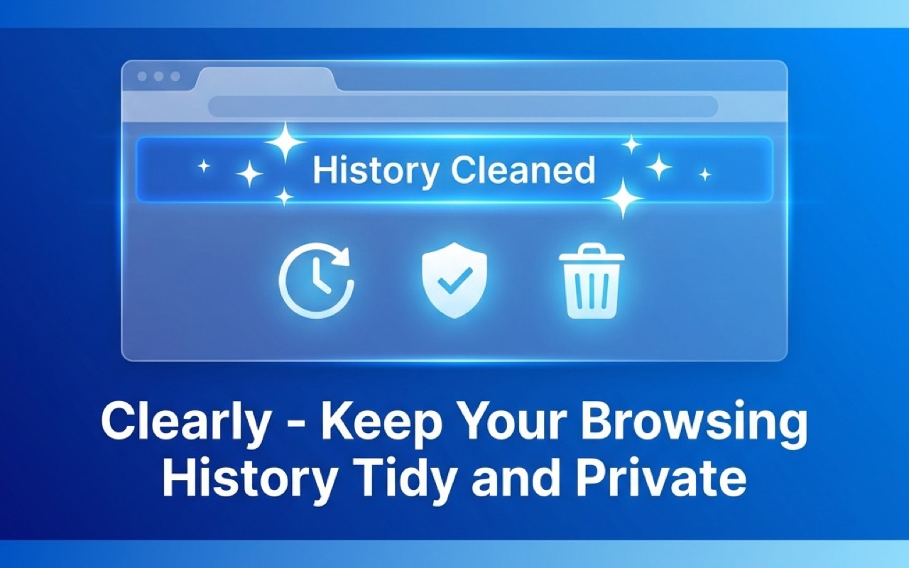

# Clearly - History Cleaner

> 让浏览历史保持清爽，支持搜索过滤和自动定时清理。



## ✨ 功能特性

- **实时监听秒删** — 新增访问记录时立即检查规则，命中即删
- **自动定时清理** — 后台定时巡检，自动清理历史记录和下载记录
- **右键菜单快捷添加** — 在任意页面右键即可将当前域名加入清理规则
- **按时间范围清理** — 支持快速清理指定时间段内的历史记录
- **多维度匹配规则** — 支持按域名、关键词等方式配置清理规则
- **全局 Toast 通知** — 清理操作后即时反馈
- **多语言支持** — 支持中文 / English

## 🛠️ 技术栈

- [WXT](https://wxt.dev/) — 下一代浏览器扩展开发框架
- [Vue 3](https://vuejs.org/) — 渐进式 JavaScript 框架
- TypeScript

## 📦 安装

### 从商店安装

- [Chrome Web Store](https://chromewebstore.google.com/)（搜索 "Clearly - History Cleaner"）
- [Edge Add-ons](https://microsoftedge.microsoft.com/addons/)（搜索 "Clearly - History Cleaner"）

### 从源码构建

```bash
# 克隆项目
git clone https://github.com/kentxxq/clearly.git
cd clearly

# 安装依赖
pnpm install

# 开发模式（默认 Edge）
pnpm dev

# 打包
pnpm zip            # Chrome
pnpm zip -b edge    # Edge
```

## 📋 Changelog

### v0.0.4

- 修复打包产物名称错误（`wxt-vue-starter` → `clearly`）
- 修复发布脚本中的 zip 文件名引用

### v0.0.3

- 添加按时间范围快速清理历史记录功能
- 实现全局 Toast 通知系统
- 更新历史服务以支持新的历史记录操作

### v0.0.2

- 修复无法删除记录的问题（manifest v3 必须同步注册事件）
- 调整打包输出目录
- 移除无用的 content script
- 上架相关图片和文本
- 去掉不必要的权限申请

### v0.0.1

- 🎉 初始版本发布
- 自动清理功能
- 支持中英文双语
- 更换 Logo，添加日志面板
- 右键菜单、定时清理、实时监听等核心功能

## 📄 License

MIT
